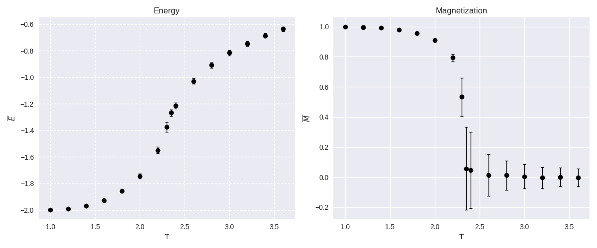
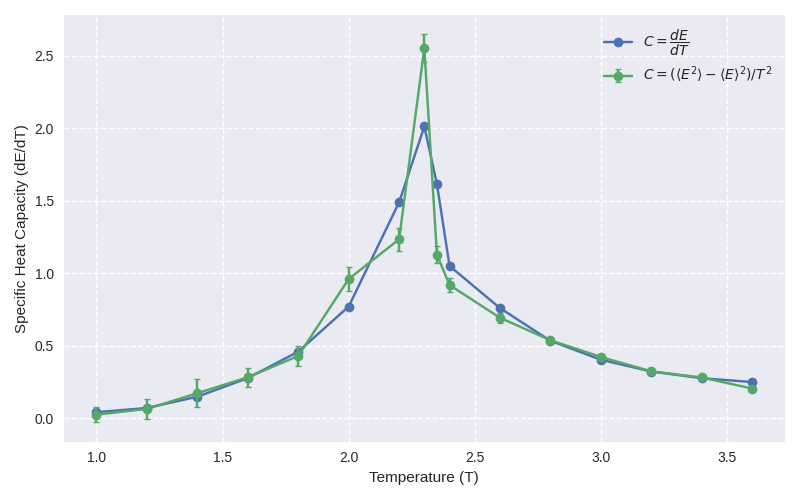
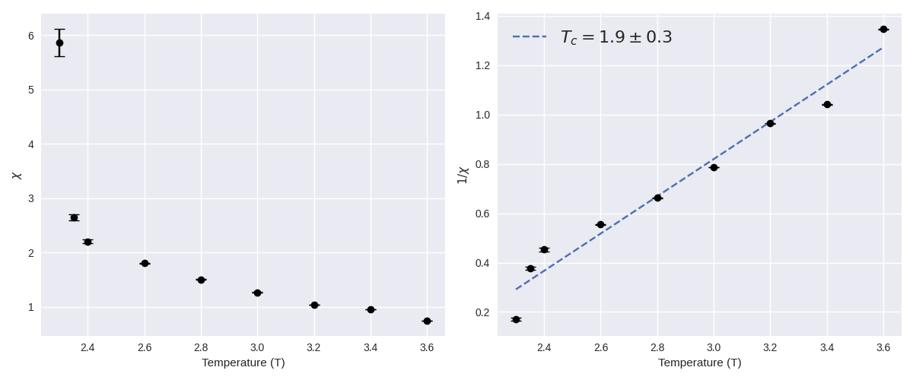

## Модель Изинга

Основные расчёты проводились на системе 100x100 спинов. Графики для средних энергии (на атом) и магнитного момента (на атом) приведены на рисунках ниже

Как можно заметить погрешность резко возрастает в какой-то момент при определении магнитного момента. Связана такая вещь с тем, что выход на равновесие ближе к точке Кюри становится очень долгим. В теории (это же Монте-Карло) после точки Кюри мы рано или поздно должны попасть в размагниченное состояние, однако шагов для этого потребуется в близи данной точки сделать очень много.

График для теплоемкостей:

График для магнитной восприимчивости

$T_c$ - это оценочная температура Кюри из соотношения $\chi \sim \dfrac{1}{T_c - T}$