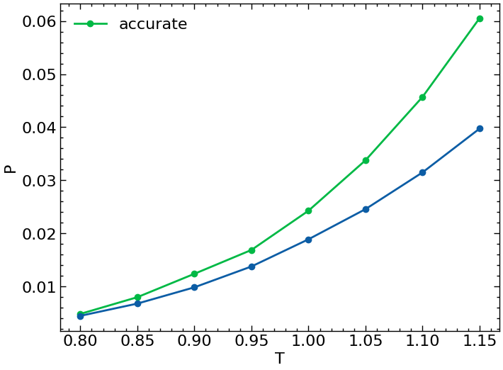

## Расчёт кривой фазового равновесия

С помощью численного интегрирования уравнения Клаузиуса-Клайперона
$$ \dfrac{dP}{dT} = \dfrac{\Delta h}{T \Delta v}$$
 вычисляется кривая фазового равномесия $\mu(P, T) = const$.

 Численное интегрирование происходит с помощью метода Богацкого-Шампина, который позволяет отслеживать точность интегрирования введением дополнительного расчёта более высокого порядка. Для начался убедимся в точности метода ведением двух отдельных траекторий от разных порядков аппроксимаций, причём для упрощения было сделано предположение о малой зависимости $\Delta h$ и $\Delta v$ от времени.

 Результаты следующие _n - порядок аппроксимации

 | T     | P_gas_3    | P_gas_2    | Error      | h_liq_3          | h_gas_3        | v_liq_3      | v_gas_3       | h_liq_2          | h_gas_2        | v_liq_2      | v_gas_2       |
|-------|------------|------------|------------|------------------|----------------|--------------|---------------|------------------|----------------|--------------|---------------|
| 0.80  | 0.00450    | 0.00450    | -          | -4.504223        | 1.8982238      | 1.2514409    | 169.71892     | -4.504223        | 1.8982238      | 1.2514409    | 169.718922    |
| 0.85  | 0.00680399 | 0.00680851 | 0.00000452 | -4.231762148     | 1.978798537    | 1.288406882  | 117.1717305   | -4.231979109     | 1.985475935    | 1.288190558  | 117.4297456   |
| 0.90  | 0.00986731 | 0.00987406 | 0.00000565 | -3.955596153     | 2.057692514    | 1.328551329  | 84.25180761   | -3.955481290     | 2.064045173    | 1.328660941  | 84.43257788   |
| 0.95  | 0.01378808 | 0.01379719 | 0.00000683 | -3.670894135     | 2.131446603    | 1.374188389  | 62.67787722   | -3.665909335     | 2.132354844    | 1.375204998  | 62.56792754   |
| 1.00  | 0.01890551 | 0.01892923 | 0.00000893 | -3.370163102     | 2.183578668    | 1.427355823  | 46.91719540   | -3.363098575     | 2.182850349    | 1.428875444  | 46.80414467   |
| 1.05  | 0.02458504 | 0.02462360 | 0.00000849 | -3.050540538     | 2.239317190    | 1.491386545  | 37.07960774   | -3.054570877     | 2.238581839    | 1.490230175  | 37.04927698   |
| 1.10  | 0.03149982 | 0.03155871 | 0.00001034 | -2.715370686     | 2.292173687    | 1.567994920  | 29.83741117   | -2.727729066     | 2.286625600    | 1.565244969  | 29.66143486   |
| 1.15  | 0.03974023 | 0.03987360 | 0.00001240 | -                 | -              | -            | -             | -                 | -              | -            | -             |

З

График фазовой кривой

График ошибок

Как можно заметить точность самого метода совпадает с примерными погрешностями результатов самого метода МД. Теперь воспользуемся методом 2-го порядка с использованием уже промежуточных точек. В этот раз будет начинать интегрирование из точки при T = 0.9.

| T      | P      | v_liq  | h_liq   | v_vap   | h_vap  | f(P, T) |
|--------|--------|--------|---------|---------|--------|---------|
| 0.9    | 0.01246| 1.32795| -3.95789| 65.31139| 2.01209| 0.10367 |
| 0.9250 | 0.01505| 1.34999| -3.80845| 54.61223| 2.02626| 0.11843 |
| 0.9375 | 0.01690| 1.36202| -3.73765| 48.94779| 2.03090| 0.12931 |
| 0.9500 | 0.01846| 1.37321| -3.66613| 44.82296| 2.03342| 0.13808 |
| 0.9750 | 0.02191| 1.39726| -3.52103| 38.16676| 2.05147| 0.15544 |
| 0.9875 | 0.02428| 1.41192| -3.44607| 34.42579| 2.04430| 0.16841 |
| 1.0000 | 0.02632| 1.42548| -3.36249| 31.80095| 2.03805| 0.17779 |
| 1.0250 | 0.03077| 1.45498| -3.21298| 27.19378| 2.03245| 0.19882 |
| 1.0375 | 0.03378| 1.46778| -3.13934| 24.60372| 2.01019| 0.21453 |
| 1.0500 | 0.03638| 1.48428| -3.05554| 22.88440| 2.00662| 0.22528 |
| 1.0750 | 0.04201| 1.51754| -2.89130| 19.75839| 1.98843| 0.24885 |
| 1.0875 | 0.04571| 1.53745| -2.80766| 17.86866| 1.94935| 0.26785 |
| 1.1000 | 0.04898| 1.55591| -2.72062| 16.68622| 1.94083| 0.28008 |
|1.1500	 | 0.06457|	1.63981| -2.36658| 12.04727| 1.78684| 0.34703 |

| T      | P      | v_liq  | h_liq   | v_vap    | h_vap  | f(P, T) |
|--------|--------|--------|---------|----------|--------|---------|
| 0.9000 | 0.01246| 1.32795| -3.95789| 65.31139 | 2.01209| 0.10367 |
| 0.8750 | 0.00992| 1.30753| -4.09463| 81.70892 | 1.99337| 0.08653 |
| 0.8625 | 0.00921| 1.29768| -4.16152| 86.29038 | 1.96864| 0.08358 |
| 0.8500 | 0.00801| 1.28792| -4.23683| 98.60187 | 1.95243| 0.07481 |
| 0.8250 | 0.00611| 1.26942| -4.37269| 127.12684| 1.93482| 0.06072 |
| 0.8125 | 0.00571| 1.26003| -4.43902| 134.25079| 1.90563| 0.05873 |
| 0.8000 | 0.00486| 1.25052| -4.50723| 156.08541| 1.88481| 0.05160 |

Таким образом следующая зависимость:

Теперь рассчитем химпотенциалы в каждой точке. Расчёт будет происходить с помощью термодинамического интегрирования через ослабления взаимодействия с одной из частиц. Я решил выбрать сетку из нулей многочленов Чебышева. Но не для того, чтобы брать интеграл по квадратурам, а чтобы сделать наиболее точный интерполянт. Интегрирование по квадратурам не имеет особого смысла, потому что наибольшие значения функция принимает лишь на малом промежутке, причём вес у них, так как они на краю, будет очень большой. 

В то же время с помощью интерполирования и последующего интегрирования, можно добиться хороших результатов, в частности, на 25 узлах Чебышева для примера с занятия:

Получается хим потенциал -1.38. В то же время ожидаемое значение: -1.5, по сравнению с равномерной сеткой по 25 точкам - это очень хороший результат. 
Наилучшая интерполяция (без "переобучения") оказалась с помощью PchipInterpolator (модифицированный кубический сплайн)

В расчётах было использовано 50 узлов Чебышева для каждой фазы и точки на кривой.

Химпотенциал жидкости

Химпотенциал газа

Итого, зависимость, которую было необходимо исследовать:

Несколько отличается, но на обоих кривых можно отметить идентичный наклон. С одной стороны, хотелось бы в различии винить методы термодинамического интегрирования, в том смысле, что неточность самого численного интегрирования, однако, вероятно, проблема и в самом методе в области $\lambda = 0$, где уже непонятно насколько точно будет определяться $\dfrac{dU}{d\lambda}.$