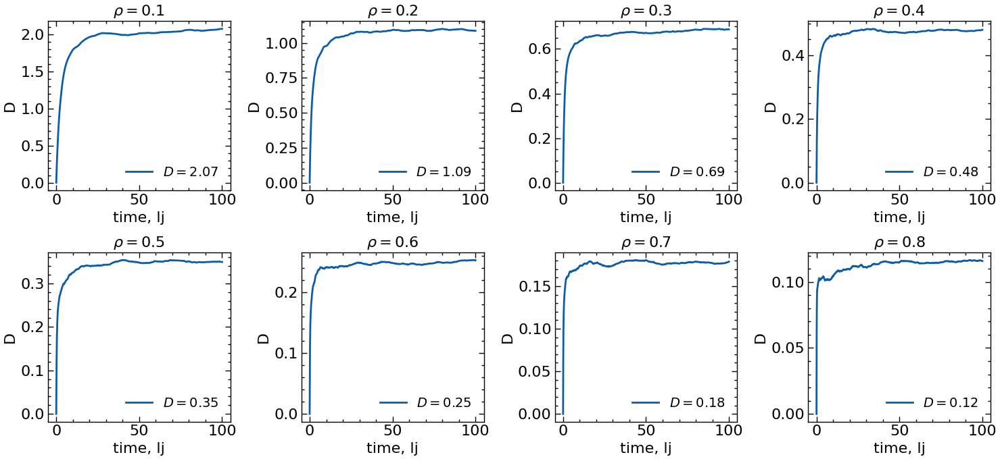
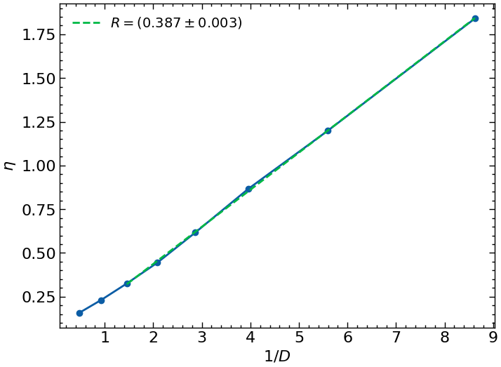

### Вычисление коэффициентов вязкости и самодиффузии для Леннард-Джонсовской жидкости.

Мой номер в списке: 5, поэтому расчёты будем вести при температуре T = 1.55.

#### Диффузия

Чтобы не иметь дело с траекториями в очень хорошем разрешении при вычислении АКФ скорости, я буду считать диффузию по msd. Траектории пришлось удлинить в несколько раз для того, чтобы добиться сходимости:

#### Вязкость

Здесь так же потребовалось удлинять траектории, чтобы получить сходимость получше, однако при малых плотностях всё равно не удалось достичь хорошеё сходимости. Но размер файлов достиг уже Гигабайта, поэтому я для проверки соотношения Стокса-Эйнштейна не буду использовать первые точки:

#### Соотношение Стокса-Эйнштейна

Данное соотношение имеет следующий вид:

$$D = \dfrac{kT}{6 \pi \eta R}$$

Поэтому в таком виде

$$\eta = \dfrac{kT}{6\pi R} \dfrac{1}{D}$$

Будем иметь линейную зависимость

Оценим справедливость полученного значения. $\sigma_{Ar} \sim 3.4 \AA$, поэтому $R \sim 300$ нм, что, вообще говоря, есть очень большое значение    