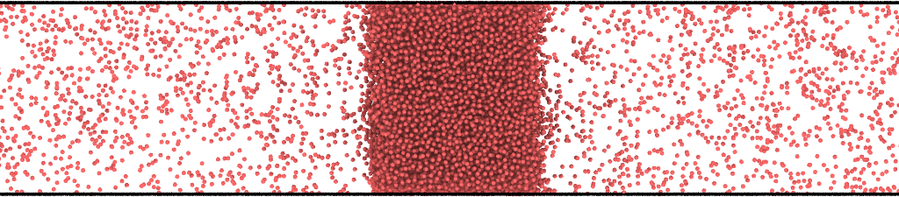
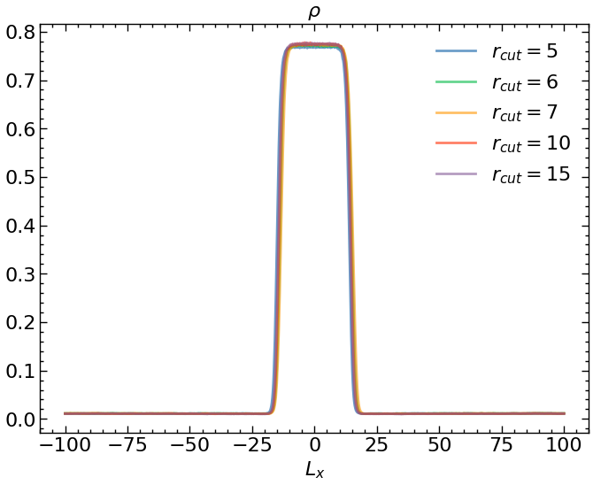
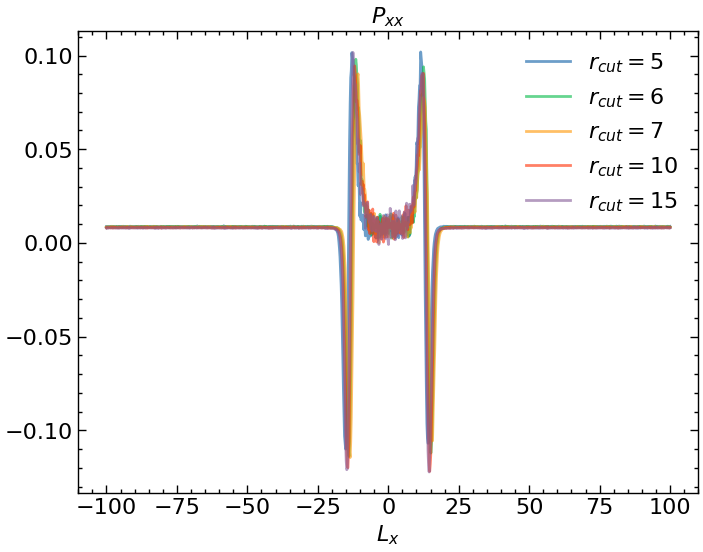
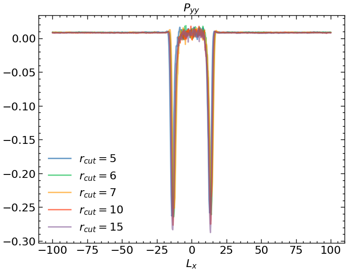
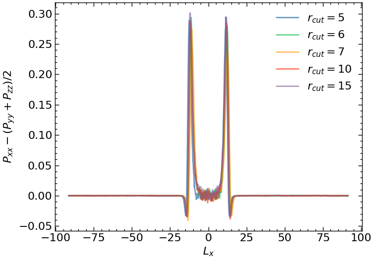
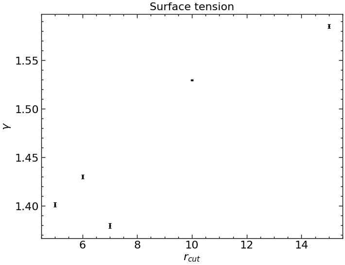
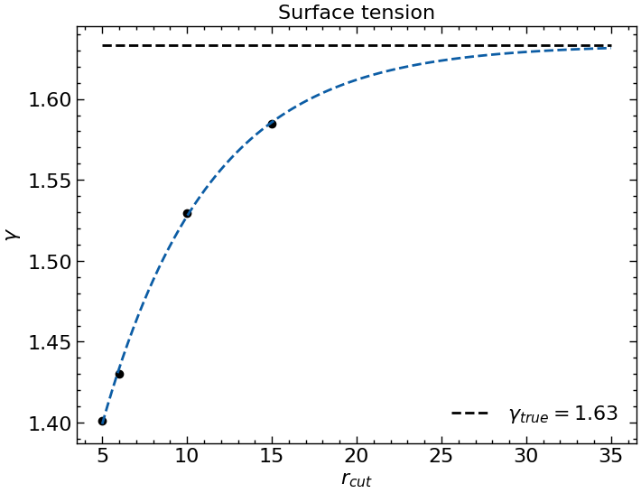

### Поверхностное натяжение

Предлагается рассчитать поверхностное натяжение структуры вида

Я выбрал температуру 0.85.

С помощью compute/atom bin/1d Был произведён расчёт профиля плотности:

А также получены значения давлений Pxx, Pyy, Pzz вдоль оси x:

Как можно заметить, для $P_{yy}$ имеется несколько странный результат. Поскольку область жидкости имеет плоские границы, то ожидается отсутствие напряжения вдоль этих направлений, но на деле, даже с увеличением радиуса обрезки потенциала, мы видим иное, что может быть связано с самим способом расчёта compute/stress atom, который даёт неверные оценки для локальных давлений.

Посчитаем теперь коэффициент поверхностного натяжения по формуле 

$$

\gamma = \int_{-L_x / 2}^{L_x/2} \left(P_{xx} - \dfrac{P_{yy} + P_{zz}}{2}\right) dx

$$

Интегранта имеет следующий вид:

Воспользуемся формулой трапеций и оценим погрешность численного интегрирования как $err = \dfrac{I(h) - I(2h)}{2 ^ p - 1}$.

В целом (за исключением одной точки) можно сделать вывод о стремлении коэффициента к какому-то определённому значению с увеличением радиуса обрезки. Попробуем зафиттировать экспонентой:

$$\gamma_{true} = \gamma - \gamma_0 e ^{C (r_{cut} - r_{cut}^0)}$$

Тогда итоговое значение $\gamma$:

$$\gamma_{true} = 1.63$$